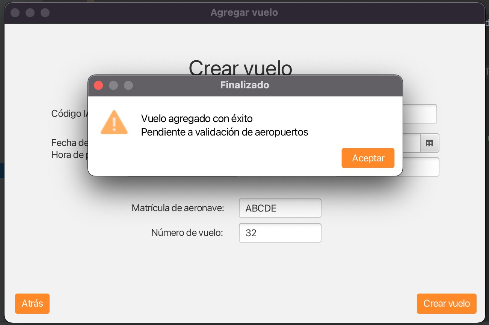

# Entregable TIC 2023
## Magalí Dellapiazza, Baltasar Henderson, Patrick Hobbins
## Bienvenidos a:

### ¿Qué es EaseFlight?
EaseFlight es un sistema de aeropuertos, basado en un flujo dependiente del usuario que ingresa. Lo pueden usar tanto aerolíneas como aeropuertos internacionales o locales, como pasajeros0 administrar sus reservas y realizar check-in. El sistema está pensado para ser utilizado por usuarios que no necesariamente tienen conocimientos avanzados de informática, por lo que se ha puesto especial énfasis en la usabilidad y la accesibilidad.

### ¿Cómo se usa EaseFlight?
#### Login
Cualquier usuario entra a través de este login poniendo su mail y contraseña. Si es pasajero, se puede registrar con el boton de registrarse, de lo contrario, si es un trabajador el único que puede crearle un usuario son los administradores. El admin del sistema crea aerolíneas y aeropuertos con sus administradores correspondientes. Estos administradores son los unicos que pueden crear trabajadores para sus aerolíneas o aeropuertos.
#### Admin General
El administrador general es el encargado de administrar el sistema. Se inicia sesión con el usuario admin@sistema.com y contraseña admin. Una vez iniciada la sesión, el administrador general puede administrar los aeropuertos y aerolíneas. Para ello, el administrador general puede crear una aerolínea o buscar una aerolínea. Para crear aerolíneas simplemente se deben llenar campos y la opción de buscar aerolínea es una tabla dinámica que filtra resultados por un cuadro de texto. Mismas funcionalidaddes para el caso de administrar aeropuerto.
#### Admin Aerolínea
Puede administrar vuelos, aviones y agregar trabajadores. En el caso de administrar vuelos, se puede agregar vuelos y ver vuelos. Se tiene un listado de aviones por aerolínea, y se puede agregar un avión (simplemente llenando campos). Se puede agregar un trabajador simplemente llenando campos.
#### Trabajador Aerolínea
Puede administrar vuelos o agregar un pasajero. En el caso de administrar vuelos, se puede agregar vuelos y ver vuelos. Se puede agregar un pasajero a un vuelo ingresando el pasaporte y seleccionando el vuelo en una tabla.
#### Admin Aeropuerto
Administra trabajadores. Se puede agregar un trabajador simplemente llenando campos, o borrar un trabajador pasando el número de documento.
#### Trabajador Aeropuerto
Puede ver vuelos tanto de llegada como de salida. Puede validar vuelos, ver pistas y puertas. Puede hacer check-in de los vuelos en el que este aeropuerto sea origen. Puede también marcar valijas entregadas de los vuelos en el que el aeropuerto es destino.
#### Pasajero
Puede ver sus vuelos y puede ver el estado de sus valijas.

## Consideraciones:
Se necesita buildear el archivo build.gradle, tener las versiones actualizadas de Gradle y en caso de no funcionar, hacer un wrapper.

### Conexión con base de datos
url: jdbc:mysql://34.41.26.182:3306/easeflightdb

usuario: root

password: admin

Driver class: com.mysql.cj.jdbc.Driver

Puede entrar cualquier IP
### Link al git: https://github.com/MagaliDellapiazza02/Proyecto_TIC1.git

### Arreglado el bug de creacion de vuelos
Se había perdido un @Autowired para el FlightMgr flightMgr de la línea 93 de la clase AddFlightController.
